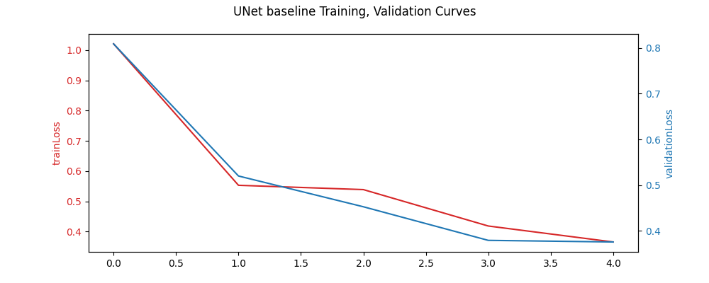
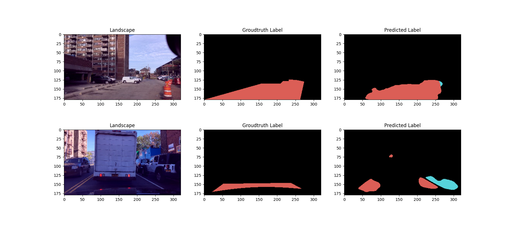

### UNet Tutorial

An example of a UNet architecture built using torch for semantic segmentation.

The overall codebase is not well-refined but to showcase using torch framework to built a U-Net

The model was trained for 5 epochs:

Example inference on test set:
